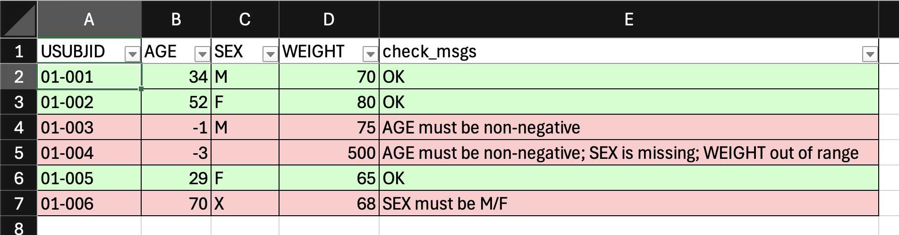
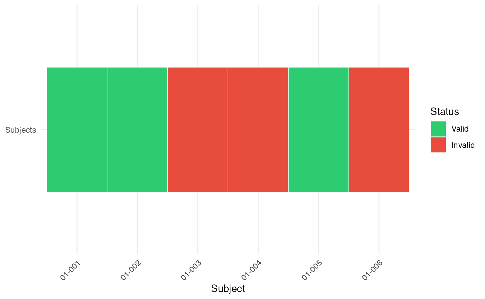
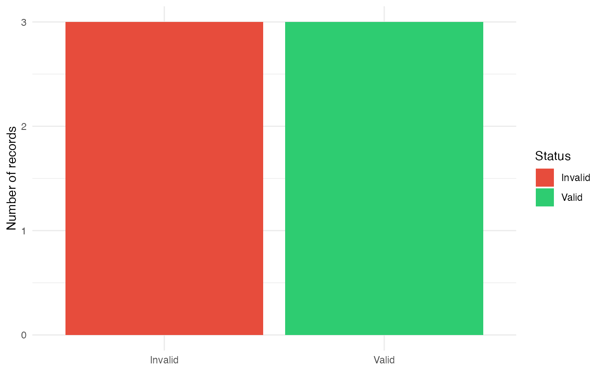
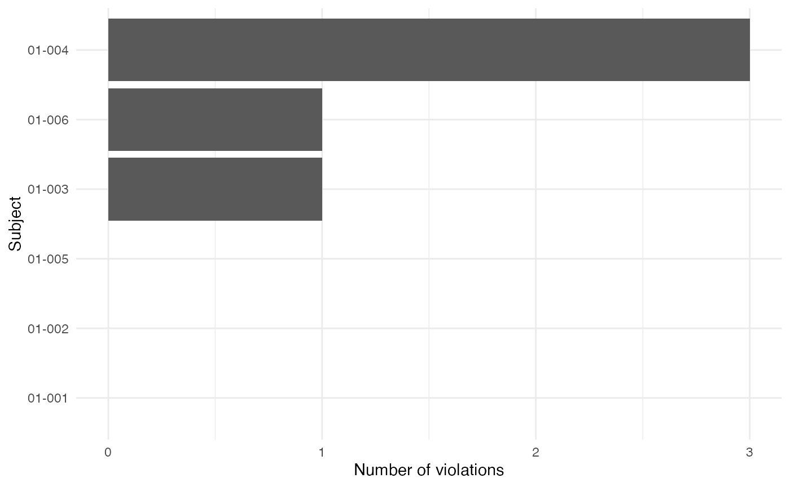

# Powerful Data Validation Engine

``` r

library(tidyr)
library(dplyr, warn.conflicts = FALSE)
library(tibble)
library(glue)
library(ggplot2)
library(ksCompare)
```

## Introduction

Data validation is a critical component of any data analysis pipeline.
In this article, we’ll explore a powerful validation framework centered
around the
[`ks_check_rules()`](https://al-garik.github.io/ksCompare/reference/ks_check_rules.md)
function from the `ksCompare` package. This function provides a
flexible, declarative approach to validating data frames with
comprehensive error reporting.

| Function | Purpose |
|----|----|
| `ks_check_rules` | apply validation rules row-wise |
| `ks_collapse_check_msgs` | flatten list-column to character |
| `ks_check_summary` | programmatic overview + violation breakdown |
| `ks_check_report_html` | self-contained HTML check report |
| `ks_compare_check_state` | diff two validation runs (new / changed / unchanged) |
| `ks_save2xlsx_by` | split-by-group XLSX with conditional formatting |

## Overview

The
[`ks_check_rules()`](https://al-garik.github.io/ksCompare/reference/ks_check_rules.md)
function we introduced implements a flexible rule-based validation
system for data frames. It enables specifying validation rules as a list
of named rule objects, applying them against your data, and collecting
results systematically.

### Key Features

- **Declarative rules:** Define validation logic in a clean, reusable
  structure
- **Two evaluation modes:** `"first"` (stops at first failure)
  vs. `"all"` (checks all rules)
- **Rich diagnostics:** Per-row messages; collapse to a plain character
  column with
  [`ks_collapse_check_msgs()`](https://al-garik.github.io/ksCompare/reference/ks_collapse_check_msgs.md)
- **Programmatic summary:**
  [`ks_check_summary()`](https://al-garik.github.io/ksCompare/reference/ks_check_summary.md)
  returns a tidy overview and violation-by-rule breakdown without
  writing any file
- **Self-contained HTML report:**
  [`ks_check_report_html()`](https://al-garik.github.io/ksCompare/reference/ks_check_report_html.md)
  writes a single portable `.html` file — no Quarto, knitr, or internet
  access required
- **Run-over-run comparison:**
  [`ks_compare_check_state()`](https://al-garik.github.io/ksCompare/reference/ks_compare_check_state.md)
  tags rows as `"new"`, `"changed"`, or unchanged relative to a previous
  snapshot
- **XLSX output with highlighting:**
  [`ks_save2xlsx_by()`](https://al-garik.github.io/ksCompare/reference/ks_save2xlsx_by.md)
  splits results into one worksheet per group and applies conditional
  row colouring driven by the message column

## Core Concepts

### Rule Structure

Each rule is a list containing two required elements:

``` r

rule <- list(
  expr = ~ CONDITION_HERE,     # One-sided formula with logical expression
  msg = "Error message"        # Message for failing rows
)
```

**Important:** The expression should evaluate to `TRUE` for *failing*
rows. While this may seem counter-intuitive at first, it follows the
convention of defining “failure conditions” rather than “passing
conditions.”

### Data Structure

Your data frame can contain any mix of variable types. Rules will be
applied row-wise.

### Result Structure

The return value is your original data frame with an additional column
called `check_msgs`, a list-column where each element contains:

- `"OK"` for rows that pass all validation rules
- In `"first"` mode: The first failing message (or `"OK"`)
- In `"all"` mode: A character vector of all violated messages (or
  `"OK"`)

## Usage Examples

### Complete Example

#### Example data:

``` r

# Sample data with intentional errors
adsl <- tibble(
  USUBJID = sprintf("01-%03d", 1:6),
  AGE = c(34, 52, -1, -3, 29, 70),
  SEX = c("M", "F", "M", NA, "F", "X"),
  WEIGHT = c(70, 80, 75, 500, 65, 68)
)
```

#### Validation rules

**Best practice:** Group related rules together and use descriptive
names. While not mandatory, named rules improve code maintainability and
make debugging easier:

``` r

# Define validation rules
rules <- list(
  # Rule 1: Age must be non-negative
  age_non_negative = list(
    expr = ~ AGE < 0,
    msg = "AGE must be non-negative"
  ),
  
  # Rule 2: SEX cannot be missing
  sex_not_missing = list(
    expr = ~ is.na(SEX),
    msg = "SEX is missing"
  ),
  
  # Rule 3: SEX must be M or F (ignoring missing)
  sex_valid = list(
    expr = ~ !is.na(SEX) & !(SEX %in% c("M", "F")),
    msg = "SEX must be M/F"
  ),
  
  # Rule 4: WEIGHT within reasonable range
  weight_range = list(
    expr = ~ WEIGHT > 300,
    msg = "WEIGHT out of range"
  )
)
```

Let’s extend our rules with some advanced expressions. We can use
regular expressions easily:

``` r

rules <- append(rules, list(
  # --- Study Subject Identifier ---
  usubjid_format = list(
    expr = ~ !grepl("^\\d{2}-\\d{3}$", USUBJID),
    msg = "USUBJID must match format: XX-XXX-XXX"
  )
))

ks_check_rules(adsl, rules, mode = "all") |> 
  ks_collapse_check_msgs(col = check_msgs)
#> # A tibble: 6 × 5
#>   USUBJID   AGE SEX   WEIGHT check_msgs                                         
#>   <chr>   <dbl> <chr>  <dbl> <chr>                                              
#> 1 01-001     34 M         70 OK                                                 
#> 2 01-002     52 F         80 OK                                                 
#> 3 01-003     -1 M         75 AGE must be non-negative                           
#> 4 01-004     -3 NA       500 AGE must be non-negative; SEX is missing; WEIGHT o…
#> 5 01-005     29 F         65 OK                                                 
#> 6 01-006     70 X         68 SEX must be M/F
```

Apply rules in first-failing mode:

``` r

result_first <- ks_check_rules(adsl, rules, mode = "first") |> 
  ks_collapse_check_msgs(col = check_msgs)

result_first[, c("USUBJID", "check_msgs")]
#> # A tibble: 6 × 2
#>   USUBJID check_msgs              
#>   <chr>   <chr>                   
#> 1 01-001  OK                      
#> 2 01-002  OK                      
#> 3 01-003  AGE must be non-negative
#> 4 01-004  AGE must be non-negative
#> 5 01-005  OK                      
#> 6 01-006  SEX must be M/F
```

Apply rules collecting all failures:

``` r

result_all <- ks_check_rules(adsl, rules, mode = "all") |> 
  ks_collapse_check_msgs(col = check_msgs)

result_all[, c("USUBJID", "check_msgs")]
#> # A tibble: 6 × 2
#>   USUBJID check_msgs                                                   
#>   <chr>   <chr>                                                        
#> 1 01-001  OK                                                           
#> 2 01-002  OK                                                           
#> 3 01-003  AGE must be non-negative                                     
#> 4 01-004  AGE must be non-negative; SEX is missing; WEIGHT out of range
#> 5 01-005  OK                                                           
#> 6 01-006  SEX must be M/F
```

## Mode Comparison

| Feature | First Mode | All Mode |
|----|----|----|
| Row processing | Stops at first failure | Checks all rules |
| Performance | Faster (shorter evaluation) | Slower (complete check) |
| Result detail | Minimalist (one message max) | Complete (all relevant messages) |
| Use case | General validation | Thorough validation |

### When to Use Which?

``` r

# Typical use cases

# Quick validation - stop at first issue found
quick_check <- ks_check_rules(adsl, rules, mode = "first")

quick_check
#> # A tibble: 6 × 5
#>   USUBJID   AGE SEX   WEIGHT check_msgs
#>   <chr>   <dbl> <chr>  <dbl> <list>    
#> 1 01-001     34 M         70 <chr [1]> 
#> 2 01-002     52 F         80 <chr [1]> 
#> 3 01-003     -1 M         75 <chr [1]> 
#> 4 01-004     -3 NA       500 <chr [1]> 
#> 5 01-005     29 F         65 <chr [1]> 
#> 6 01-006     70 X         68 <chr [1]>

# Comprehensive validation - get all issues for full validation
full_audit <- ks_check_rules(adsl, rules, mode = "all")

full_audit
#> # A tibble: 6 × 5
#>   USUBJID   AGE SEX   WEIGHT check_msgs
#>   <chr>   <dbl> <chr>  <dbl> <list>    
#> 1 01-001     34 M         70 <chr [1]> 
#> 2 01-002     52 F         80 <chr [1]> 
#> 3 01-003     -1 M         75 <chr [1]> 
#> 4 01-004     -3 NA       500 <chr [3]> 
#> 5 01-005     29 F         65 <chr [1]> 
#> 6 01-006     70 X         68 <chr [1]>

# Quality assurance check - ensure no errors exist
strict_validation <- function(data, rules) {

  result <- ks_check_rules(data, rules, mode = "all")

  valid <- purrr::map_lgl(result$check_msgs, ~ "OK" %in% .x)

  if (!all(valid)) {

    msgs <- unique(unlist(result$check_msgs[!valid]))

    stop(
      paste0(
        "Validation failed:\n",
        paste0(" - ", msgs, collapse = "\n")
      ),
      call. = FALSE
    )
  }

  invisible(result)
}

# Demonstrate the strict validation error handling
tryCatch(
  strict_validation(adsl, rules),
  error = function(e) {
    cat("Error caught as expected:\n")
    cat(conditionMessage(e), "\n")
  }
)
#> Error caught as expected:
#> Validation failed:
#>  - AGE must be non-negative
#>  - SEX is missing
#>  - WEIGHT out of range
#>  - SEX must be M/F
```

### Performance Tips

1.  **Order matters in “first” mode:** Place faster-to-evaluate rules
    first for performance gain
2.  **Group related columns:** Organize rules by data columns for better
    organization
3.  **Use vectorized operations:** Write expressions using vectorized
    functions

## Error Message Design

Follow these guidelines for effective messages:

1.  **Be specific:** Identify exactly what’s wrong
2.  **Suggest correction:** Include acceptable formats when helpful
3.  **Reference standards:** Mention relevant regulations or guidelines
4.  **Use consistent format:** Maintain uniform wording conventions

&nbsp;

    GOOD: "Date format must be YYYY-MM-DD. Value: '01/01/2025' is invalid."
        
    BAD:  "Invalid date"

## Advanced Usage

``` r

# Using rlang expressions for dynamic rules
dynamic_age <- function(threshold_age) {
  list(
    age_threshold = list(
      expr = rlang::new_formula(
        lhs = NULL,
        rhs = rlang::expr(AGE < !!threshold_age)
      ),
      msg = sprintf(
        "Age must be at least %d years",
        threshold_age
      )
    )
  )
}

# Define rule
validation_age <- dynamic_age(18)
```

We can check our dynamic rules.

- **Rule:** `validation_age$age_threshold$expr` =\> ~AGE \< 18.
- **Message:** `validation_age$age_threshold$msg` =\> Age must be at
  least 18 years.

You can also verify the expression evaluates correctly:

``` r

rlang::eval_tidy(
  rlang::f_rhs(validation_age$age_threshold$expr),
  data = adsl
)
#> [1] FALSE FALSE  TRUE  TRUE FALSE FALSE
# Expected:
# [1] FALSE FALSE TRUE TRUE FALSE FALSE

result <- ks_check_rules(adsl, validation_age)
result |> mutate(
    check_msgs = purrr::map_chr(check_msgs, ~ paste(.x, collapse = ", "))
  )
#> # A tibble: 6 × 5
#>   USUBJID   AGE SEX   WEIGHT check_msgs                   
#>   <chr>   <dbl> <chr>  <dbl> <chr>                        
#> 1 01-001     34 M         70 OK                           
#> 2 01-002     52 F         80 OK                           
#> 3 01-003     -1 M         75 Age must be at least 18 years
#> 4 01-004     -3 NA       500 Age must be at least 18 years
#> 5 01-005     29 F         65 OK                           
#> 6 01-006     70 X         68 OK
```

### Categorizing Violations

You can post-process results to categorize violations:

``` r

classify_violations <- function(df) {
  df %>%
    mutate(
      violation_type = purrr::map_chr(
        check_msgs,
        ~ if ("OK" %in% .x) "clean" else "dirty"
      ),
      num_violations = purrr::map_int(
        check_msgs,
        ~ if ("OK" %in% .x) 0L else n_distinct(.x)
      )
    )
}

validation_result <- ks_check_rules(adsl, rules, mode = "all")

classified_data <- classify_violations(validation_result)

classified_data
#> # A tibble: 6 × 7
#>   USUBJID   AGE SEX   WEIGHT check_msgs violation_type num_violations
#>   <chr>   <dbl> <chr>  <dbl> <list>     <chr>                   <int>
#> 1 01-001     34 M         70 <chr [1]>  clean                       0
#> 2 01-002     52 F         80 <chr [1]>  clean                       0
#> 3 01-003     -1 M         75 <chr [1]>  dirty                       1
#> 4 01-004     -3 NA       500 <chr [3]>  dirty                       3
#> 5 01-005     29 F         65 <chr [1]>  clean                       0
#> 6 01-006     70 X         68 <chr [1]>  dirty                       1
```

### Generating Summary Reports

[`ks_check_summary()`](https://al-garik.github.io/ksCompare/reference/ks_check_summary.md)
returns a named list with two tibbles — `overview` (one-row totals) and
`violations` (per-message counts and percentages) — without writing any
file:

``` r

summary <- ks_check_summary(validation_result)

# Single-row KPI tibble
summary$overview
#> # A tibble: 1 × 4
#>   rows_total n_pass n_fail pass_rate
#>        <int>  <int>  <int>     <dbl>
#> 1          6      3      3       0.5

# Per-message breakdown (sorted by count descending)
summary$violations
#> # A tibble: 4 × 3
#>   message                  n_rows pct_rows
#>   <chr>                     <int>    <dbl>
#> 1 AGE must be non-negative      2    0.333
#> 2 SEX is missing                1    0.167
#> 3 SEX must be M/F               1    0.167
#> 4 WEIGHT out of range           1    0.167
```

For a quick console printout you can format the results yourself:

``` r

cat(sprintf(
  "Rows: %d | Passing: %d | Failing: %d | Pass rate: %.1f%%\n",
  summary$overview$rows_total,
  summary$overview$n_pass,
  summary$overview$n_fail,
  100 * summary$overview$pass_rate
))
#> Rows: 6 | Passing: 3 | Failing: 3 | Pass rate: 50.0%
```

### HTML Check Report

[`ks_check_report_html()`](https://al-garik.github.io/ksCompare/reference/ks_check_report_html.md)
produces a single self-contained `.html` file using `htmltools` and
`reactable` — no Quarto, no Pandoc. The report contains KPI cards, a
searchable violation summary, and a row-detail table with status badges.

``` r

# Write to disk (auto-names file when path is NULL)
ks_check_report_html(
  validation_result,
  path = "check-report.html",
  title = "ADSL validation",
  subtitle = "Study XYZ — run 2026-07-13",
  theme = "default"   # or "slate"
)

# Return an in-memory htmltools tag list for embedding
report_tags <- ks_check_report_html(validation_result, path = NA)
```

The `path` argument follows the same three-way convention as
[`ks_report_html()`](https://al-garik.github.io/ksCompare/reference/ks_report_html.md):
`NULL` → auto-named file in the working directory, `NA` → in-memory tag
list, or an explicit file path.

### XLSX Export

[`ks_save2xlsx_by()`](https://al-garik.github.io/ksCompare/reference/ks_save2xlsx_by.md)
writes one worksheet per unique value of a grouping column and applies
Excel conditional formatting so rows are colour-highlighted based on the
`check_msgs` content:

``` r

# Add a grouping column (e.g. by domain) and export
validation_result |>
  dplyr::mutate(domain = "ADSL") |>
  ks_collapse_check_msgs(col = check_msgs) |>   # XLSX needs a plain character column
  ks_save2xlsx_by(
    file   = "adsl_checks.xlsx",
    colors = c(
      "OK"              = "#CCFFCC",  # green
      "must be"         = "#FFCCCC",  # red  (substring match)
      "out of range"    = "#FFEEAA",  # amber
      "missing"         = "#FFD0D0"   # light red
    ),
    split_col = domain,
    msg_col   = check_msgs
  )
```



To layer a
[`ks_compare_check_state()`](https://al-garik.github.io/ksCompare/reference/ks_compare_check_state.md)
status column on top — so *new* and *changed* rows are highlighted
differently — pass both `status_col` and `status_colors`:

``` r

validation_result |>
  ks_collapse_check_msgs(col = check_msgs) |>
  ks_compare_check_state(
    previous     = previous_run,
    key_cols     = "USUBJID",
    compare_cols = "check_msgs"
  ) |>
  dplyr::mutate(domain = "ADSL") |>
  ks_save2xlsx_by(
    file          = "adsl_checks_delta.xlsx",
    colors        = c("OK" = "#CCFFCC", "must be" = "#FFCCCC"),
    split_col     = domain,
    msg_col       = check_msgs,
    status_col    = status,
    status_colors = c("new" = "#D0E8FF", "changed" = "#FFF3CC")
  )
```

### Tracking Changes Across Runs

[`ks_compare_check_state()`](https://al-garik.github.io/ksCompare/reference/ks_compare_check_state.md)
compares the current validation result against a saved snapshot and adds
a `status` column:

| status      | meaning                                     |
|-------------|---------------------------------------------|
| `"new"`     | Subject key not present in the previous run |
| `"changed"` | Key exists but comparison signature differs |
| `""`        | Row is identical to the previous run        |

``` r

# Simulate a "previous" run
previous_run <- ks_check_rules(adsl, rules, mode = "all") |>
  ks_collapse_check_msgs(col = check_msgs)

# Current run after data update
current_run <- adsl |>
  dplyr::mutate(AGE = replace(AGE, USUBJID == "01-003", 22L)) |>  # fix a negative age
  ks_check_rules(rules, mode = "all") |>
  ks_collapse_check_msgs(col = check_msgs)

# Compare the two runs
delta <- ks_compare_check_state(
  current     = current_run,
  previous    = previous_run,
  key_cols    = "USUBJID",
  compare_cols = "check_msgs"
)

delta[, c("USUBJID", "check_msgs", "status")]
#> # A tibble: 6 × 3
#>   USUBJID check_msgs                                                    status  
#>   <chr>   <chr>                                                         <chr>   
#> 1 01-001  OK                                                            ""      
#> 2 01-002  OK                                                            ""      
#> 3 01-003  OK                                                            "change…
#> 4 01-004  AGE must be non-negative; SEX is missing; WEIGHT out of range ""      
#> 5 01-005  OK                                                            ""      
#> 6 01-006  SEX must be M/F                                               ""
```

This is especially useful in iterative QC workflows where you want to
confirm that only the intended rows changed between data cuts.

### Visualizing Validation Results

There are several possibilities to visualize a validation:

``` r

# For a single-row heatmap-like display, add a constant y value.
visualize_results1 <- function(df) {

  df <- df %>%
    mutate(
      status = factor(
        ifelse(
          purrr::map_lgl(check_msgs, ~ "OK" %in% .x),
          "Valid",
          "Invalid"
        ),
        levels = c("Valid", "Invalid")
      ),
      y = "Subjects"
    )

  ggplot(df, aes(x = USUBJID, y = y, fill = status)) +
    geom_tile(height = 0.6, color = "white") +
    scale_fill_manual(
      values = c(
        Valid = "#2ecc71",
        Invalid = "#e74c3c"
      )
    ) +
    labs(x = "Subject", y = NULL, fill = "Status") +
    theme_minimal() +
    theme(
      axis.text.x = element_text(angle = 45, hjust = 1)
    )
}

# Alternative: Bar chart (usually more informative)
visualize_results2 <- function(df) {

  df %>%
    mutate(
      status = ifelse(
        purrr::map_lgl(check_msgs, ~ "OK" %in% .x),
        "Valid",
        "Invalid"
      )
    ) %>%
    ggplot(aes(status, fill = status)) +
    geom_bar() +
    scale_fill_manual(
      values = c(
        Valid = "#2ecc71",
        Invalid = "#e74c3c"
      )
    ) +
    labs(
      x = NULL,
      y = "Number of records",
      fill = "Status"
    ) +
    theme_minimal()
}

# Alternative: Show number of violations per subject
# If subjects can have multiple violations, this is often the most useful diagnostic plot:

visualize_results3 <- function(df) {

  df %>%
    mutate(
      n_violations = purrr::map_int(
        check_msgs,
        ~ if ("OK" %in% .x) 0L else length(.x)
      )
    ) %>%
    ggplot(aes(reorder(USUBJID, n_violations), n_violations)) +
    geom_col() +
    coord_flip() +
    labs(
      x = "Subject",
      y = "Number of violations"
    ) +
    theme_minimal()
}

# Example visualization
visualize_results1(validation_result)
```



``` r

visualize_results2(validation_result)
```



``` r

visualize_results3(validation_result)
```



For a data validation engine, the last plot tends to be the most
actionable because it immediately highlights the worst offending
records.

## Common Patterns and Recipes

### Range Checks

``` r

rules_range <- list(
  age_range = list(
    expr = ~ AGE < 18 | AGE > 120,
    msg = "Age must be between 18 and 120"
  ),
  weight_range = list(
    expr = ~ WEIGHT < 30 | WEIGHT > 250,
    msg = "Weight must be between 30 and 250 kg"
  )
)
```

### Presence Checks

``` r

rules_presence <- list(
  id_not_missing = list(
    expr = ~ is.na(USUBJID),
    msg = "Subject ID cannot be missing"
  ),
  date_complete = list(
    expr = ~ is.na(ENR_DATE) | ENR_DATE == "",
    msg = "Enrollment date must be specified"
  )
)
```

### Format Validation

``` r

rules_format <- list(
  date_format = list(
    expr = ~ !grepl("^\\d{4}-\\d{2}-\\d{2}$", ENR_DATE),
    msg = "Date must be in YYYY-MM-DD format"
  ),
  email_format = list(
    expr = ~ !grepl("^[a-zA-Z0-9._%+-]+@[a-zA-Z0-9.-]+\\.[a-zA-Z]{2,6}$", EMAIL),
    msg = "Invalid email format"
  )
)
```

### Conditional Checks

``` r

rules_conditional <- list(
  # If treatment is "Placebo", then dose must be zero
  placebo_zero_dose = list(
    expr = ~ TRTP == "Placebo" & DOSE != 0,
    msg = "Placebo must have zero dose"
  ),
  
  # If value is missing, flag specific column
  aval_not_missing = list(
    expr = ~ is.na(AVAL),
    msg = "AVAL cannot be missing"
  )
)
```

### Reference Data Checks

``` r

# Predefined reference values
reference_values <- tibble(
  code = c("M", "F", "U"),
  description = c("Male", "Female", "Unknown")
)

rules_reference <- list(
  sex_known_values = list(
    expr = ~ !is.na(SEX) & !(SEX %in% reference_values$code),
    msg = glue("Invalid SEX code. Must be one of: {paste(reference_values$code, collapse = ", ")}")
  )
)
```

## Group-Specific Validation

``` r


# Define group-specific rules
group_rules <- list(
  control_group = list(
    list(expr = ~ TRTP == "Placebo" & DOSE != 0, 
         msg = "Control group must receive zero dose"),
    list(expr = ~ TRTP == "Placebo" & !is.na(TRTA), 
         msg = "Control group TRTA should be empty")
  ),
  
  treatment_group = list(
    list(expr = ~ TRTP == "Drug A" & DOSE < 10, 
         msg = "Treatment group requires dose ≥ 10"),
    list(expr = ~ TRTP == "Drug A" & DOSE > 200, 
         msg = "Treatment group dose too high (>200)")
  ),
  
  # Default rules for all groups
  common_rules = list(
    list(expr = ~ is.na(USUBJID), 
         msg = "Subject ID required for all subjects"),
    list(expr = ~ nchar(TRTP) < 1, 
         msg = "Treatment name must be specified")
  )
)


# Apply group-specific validation
validation_result <- clinical_data |> 
  mutate(group = case_when(
    TRTP == "Placebo" ~ "control",
    TRTP %in% c("Drug A", "Drug B") ~ "treatment",
    TRUE ~ "other"
  )) |> 
  group_by(group) |> 
  ks_check_rules(
    rules = group_rules[[cur_group()]], 
    mode = "all"
  ) |> 
  ungroup()
```

## Best Practices

1.  **Modular Rule Definitions:** Organize rules into logical groups
    (entity-specific, business-specific, technical)

2.  **Descriptive Error Messages:** Include enough context to help data
    stewards understand and fix issues

3.  **Validation Layering:** Apply rule sets in logical sequences
    (format checks → range checks → business rules)

4.  **Performance Considerations:**

    - Order performance-intensive rules first
    - Use “first” mode for critical validation paths
    - Consider caching rule compilation results

5.  **Documentation:** Every rule should have clear documentation
    explaining:

    - What the rule checks
    - Why it matters
    - Expected data patterns

6.  **Configuration Management:** Store rule parameters externally
    whenever possible for easier maintenance

7.  **Graceful Degradation:** Allow partial validation when complete
    rule sets aren’t available

8.  **Integration Testing:** Always validate with realistic test data
    that includes boundary cases

## Conclusion

The
[`ks_check_rules()`](https://al-garik.github.io/ksCompare/reference/ks_check_rules.md)
framework represents a robust and flexible approach to data validation.
By providing granular control over validation rules,
performance-optimized execution, and clear error reporting, it enables
data teams to build reliable validation pipelines.

### Key Benefits

**Modular Architecture**

- Rules are decoupled from business logic
- Easy to extend and maintain
- Supports dynamic rule configuration
- Early-exit “first” mode for critical validation

**Seamless tidyverse Integration**

- Supports custom rule definitions
- Integrates naturally with data processing pipelines
- Works with standard tidyverse verbs
  ([`mutate()`](https://dplyr.tidyverse.org/reference/mutate.html),
  [`filter()`](https://dplyr.tidyverse.org/reference/filter.html), etc.)

**What’s Available Now**

| Function | What it does |
|----|----|
| [`ks_check_rules()`](https://al-garik.github.io/ksCompare/reference/ks_check_rules.md) | Apply validation rules row-wise (modes: `"first"` / `"all"`) |
| [`ks_collapse_check_msgs()`](https://al-garik.github.io/ksCompare/reference/ks_collapse_check_msgs.md) | Flatten list-column to plain character |
| [`ks_check_summary()`](https://al-garik.github.io/ksCompare/reference/ks_check_summary.md) | Programmatic overview + per-message violation breakdown |
| [`ks_check_report_html()`](https://al-garik.github.io/ksCompare/reference/ks_check_report_html.md) | Self-contained HTML report (htmltools + reactable) |
| [`ks_compare_check_state()`](https://al-garik.github.io/ksCompare/reference/ks_compare_check_state.md) | Diff two runs — tag rows as new / changed / unchanged |
| [`ks_save2xlsx_by()`](https://al-garik.github.io/ksCompare/reference/ks_save2xlsx_by.md) | Split-by-group XLSX with conditional row colouring |

**Future Roadmap**

- Rule metadata annotations (severity levels, regulation references)
- Cross-dataset relational checks (e.g. validate ADAE against ADSL keys)
- Performance optimizations for datasets \> 1 M rows

## Final Thoughts

This validation framework represents more than just error checking—it’s
a strategic data governance mechanism. By investing in thoughtful
validation patterns today, organizations can prevent downstream data
issues, improve data quality, and reduce long-term maintenance costs.

The modular design allows for incremental adoption: start with basic
schema validation, then progressively add business rules, cross-field
checks, and custom validation patterns. With comprehensive documentation
and practical examples, `ks_check_rules` aims to become an essential
tool for serious data practitioners.
